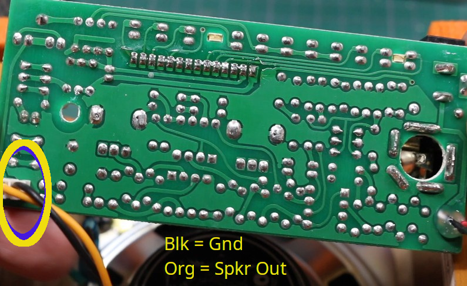
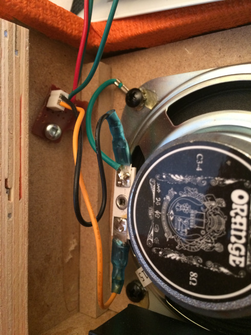
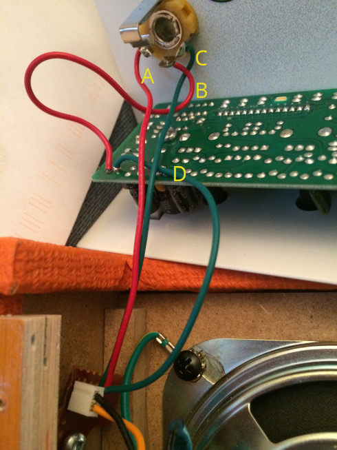
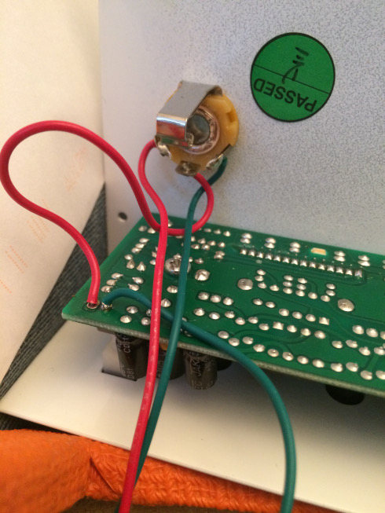
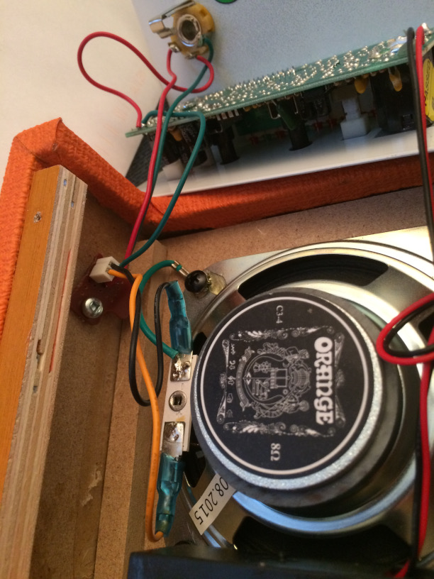

# Orange Micro Crush Amp
Add an external Speaker jack - Video here: https://youtu.be/7WM6HoQmDgU  
 
  The amp has a 2 pin header on the PCB.  A cable from the internal speaker plugs into the header. 
  The speaker cable has a black (ground) and orange (speaker signal) wire.  
     
  
  The concept is to keep the black wire going on to the built in speaker but to cut/intercept the orange signal wire, then send both sides of the cut orange signal wire, along with an extra added ground, to a 3 pin mono "switched" 1/4" jack.  
  
  When nothing is plugged into the jack, the signal from the orange wire coming from the PCB header is connected to the other jack terminal, which is wired to the internal speaker for normal operation.  
  When a plug is inserted in the jack, the internal speaker is disconnected and the amp signal is connected to the plug (external speaker). 
  Note:  Only insert or remove the plug when the amp is off to prevent damage.  Amplifiers don't like having their inductive loads removed when live. 
  
  
  
  To keep things as neat as possible and not have a bunch of messy taped up wire solder joints, I removed the 2 pin header from the PCB and soldered it to a scrap proto board, which was screwed into the side of the cabinet to hold it in place. 
  Then I soldered a red wire to the proto board and connected it (with a solder bridge) to the orange connector pin. 
  I soldered 2 green wires to the proto board and solder bridged those over to the black connector pin. 
   
   
   
The red wire (Label A) was then soldered to the left jack terminal as shown. This connects the internal speaker to the jack switch. 
   One of the green wires (Label D) was soldered to the original PCB black ground wire location. 
   The other green wire (Label C) was soldered to the right jack ground terminal. 
   Now the internal speaker as well as the external jack both have a ground connection. 
   Another red wire (Label B) was soldered from the PCB original orange amp signal output location to the jack center terminal. 
   This connects the amp signal to a plug, or else to the internal speaker. 
   
   
Text info etc   
   
Text info etc   
   
Text info etc   
  
