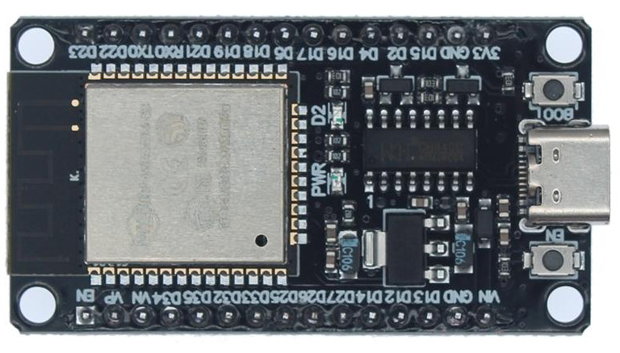

This project is continued at https://github.com/GadgetReboot/Phone_SLIM   
This project evolved from a previous [ESP8266 based prototype](https://github.com/GadgetReboot/misc_file_bin/tree/master/2022_11/Telephone_Central_Office_wip) on ESP32.  
Now using a 30 pin ESP32 DOIT Devkit V1 module  
  
